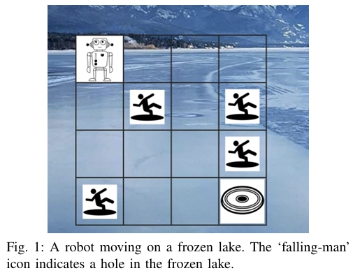
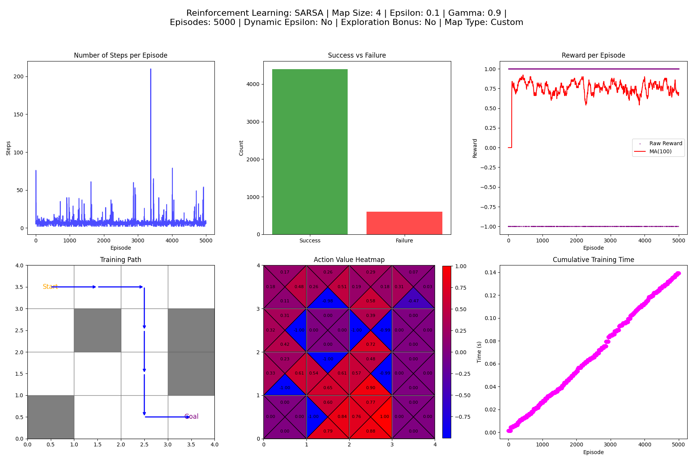
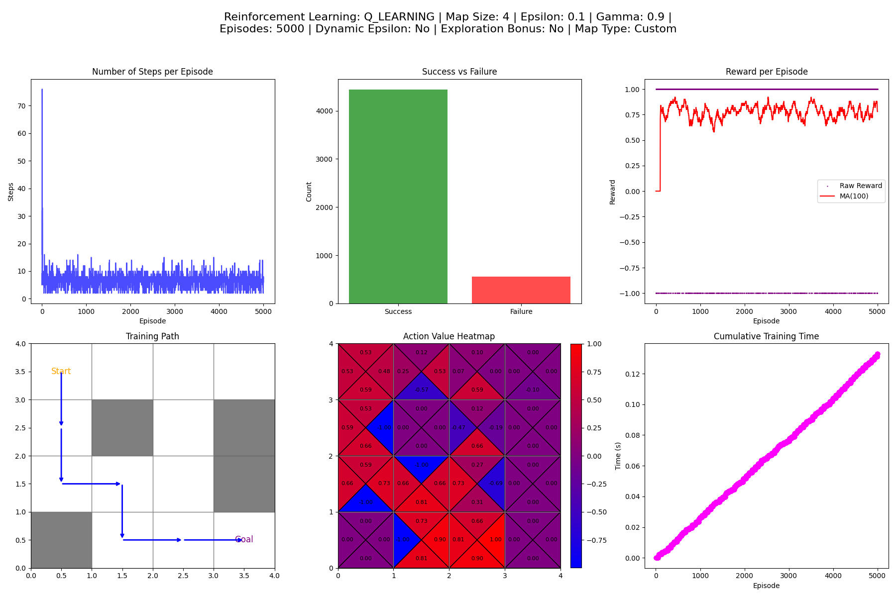
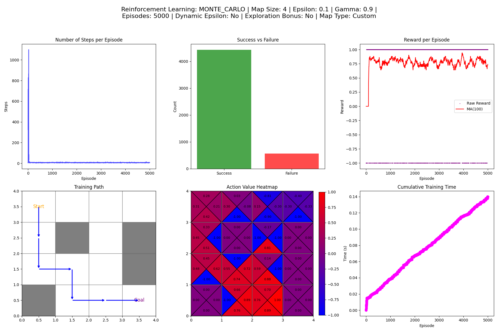
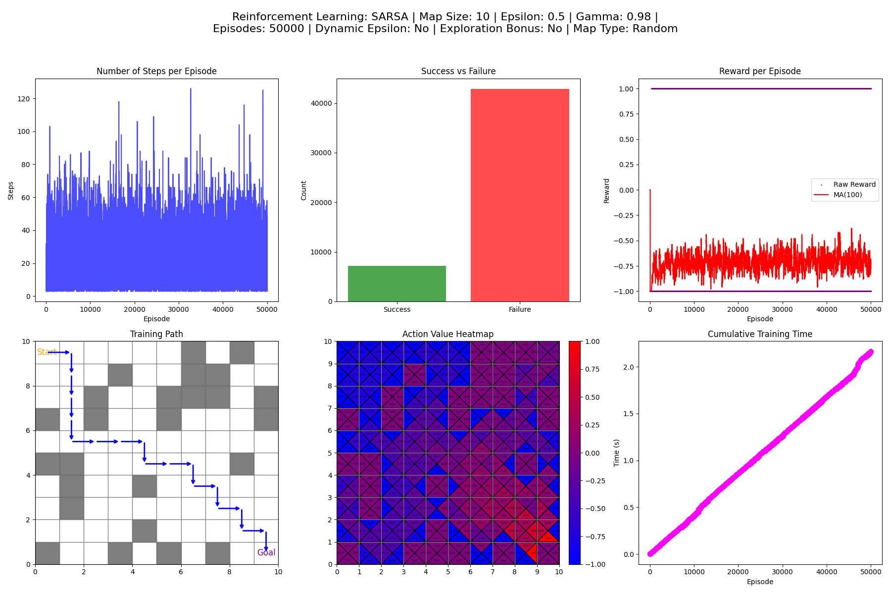
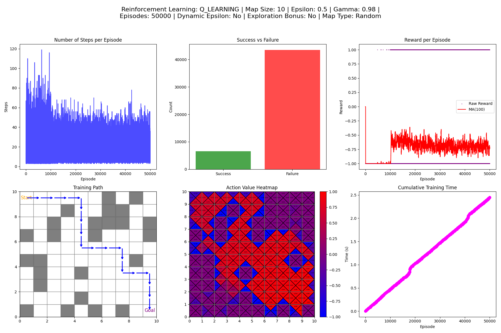
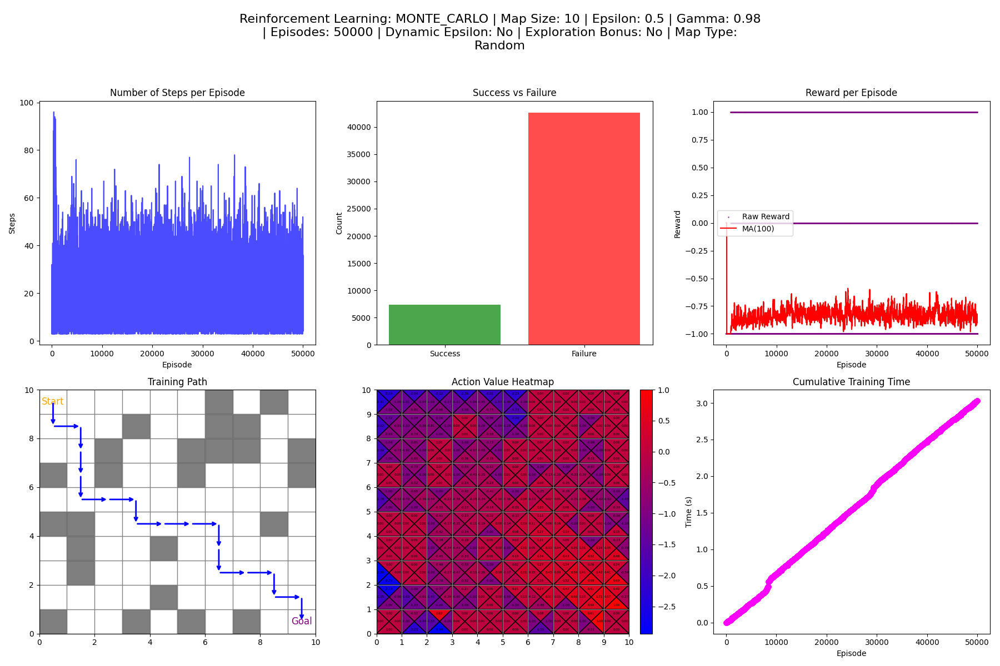

# Frozen Lake Reinforcement Learning Solver

## PROBLEM STATEMENT

Consider a frozen lake with (four) holes covered by patches of very thin ice. Suppose that a robot is to glide on the frozen surface from one location (i.e., the top left corner) to another (bottom right corner) in order to pick up a frisbee there, as is illustrated in Fig. 1.
    
 

The operation of the robot has the following characteristics:
1. At a state, the robot can move in one of four directions: left, right, up, and down.
2. The robot is confined within the grid.
3. The robot receives a reward of +1 if it reaches the frisbee, -1 if it falls into a hole, and 0 for all other cases.
4. An episode ends when the robot reaches the frisbee or falls into a hole.


## REQUIREMENT

### A. What to be done

Three tasks, with the following mark weightage, are to be completed for this project:

**Task 1: Basic Implementation (25%)**

Write a Python program to compute an optimal policy for the Frozen Lake problem described above using the following three tabular (i.e., not involving any use of a neural network) reinforcement learning techniques:
1. First-visit Monte Carlo control without exploring starts.
2. SARSA with an epsilon-greedy behavior policy.
3. Q-learning with an epsilon-greedy behavior policy.

You may choose appropriate values for parameters such as the discount factor, learning rate, etc.

**Task 2: Extended Implementation (25%)**

Increase the grid size to at least 10×10 while maintaining the same proportion between the number of holes and the number of states (i.e., 4/16 = 25%). Distribute the holes randomly without completely blocking access to the frisbee, and then repeat Task 1.

---

## Project Introduction

This project is designed to solve the Frozen Lake problem using three classical reinforcement learning algorithms. The environment is modeled as a grid where the robot (agent) must navigate from the top-left corner to the bottom-right corner, avoiding holes and reaching the goal to pick up a frisbee. The reward structure is as follows:
- **+1** for reaching the frisbee (goal).
- **-1** for falling into a hole.
- **0** for all other transitions (unless an exploration bonus is used).

This project contains several Python files:
- **env.py**: Defines the Frozen Lake environment.
- **utils.py**: Provides helper functions (epsilon-greedy action selection, Q-table initialization, plotting helpers, policy extraction, etc.).
- **monte_carlo.py**: Implements the First-Visit Monte Carlo Control algorithm.
- **sarsa.py**: Implements the SARSA algorithm.
- **q_learning.py**: Implements the Q-learning algorithm.
- **main.py**: The main script for parsing command-line arguments, running training, plotting, and saving figures.

---

## 1. Algorithms: Principles and Pseudocode Diagrams

### 1.1. First-Visit Monte Carlo Control
**Principle:**  
This method collects complete episodes using an epsilon-greedy policy, then updates the Q-table by averaging returns for first visits of state-action pairs.

**Pseudocode:**
```
Initialize Q(s, a) arbitrarily for all states s and actions a.
For each episode:
    Generate an episode: s0, a0, r1, s1, a1, r2, ..., s_T.
    For each (s, a) in the episode (first visit only):
         G = sum_{t=k}^{T} (gamma^(t-k)) * r_{t+1}
         Update Q(s, a) as average of returns.
```

### 1.2. SARSA (On-Policy)
**Principle:**  
SARSA updates the Q-value based on the current policy’s action selection. The update uses the immediate reward plus the discounted Q-value of the next state-action pair.

**Pseudocode:**
```
Initialize Q(s, a) arbitrarily for all s and a.
For each episode:
    Initialize s, choose a using epsilon-greedy policy.
    For each step in the episode:
         Take action a, observe r and s'.
         Choose a' using epsilon-greedy from Q(s', ·).
         Update Q(s, a) = Q(s, a) + alpha * [r + gamma * Q(s', a') - Q(s, a)]
         s <- s', a <- a'
         If s' is terminal, break.
```

### 1.3. Q-Learning (Off-Policy)
**Principle:**  
Q-Learning uses the maximum Q-value for the next state (irrespective of the current policy) to update the current state-action value.

**Pseudocode:**
```
Initialize Q(s, a) arbitrarily for all s and a.
For each episode:
    Initialize s.
    For each step:
         Choose action a using epsilon-greedy policy.
         Take action a, observe r and s'.
         Update Q(s, a) = Q(s, a) + alpha * [r + gamma * max_{a'} Q(s', a') - Q(s, a)]
         s <- s'
         If s' is terminal, break.
```

---

## 2. Map Generation Principles

The environment supports two map generation modes:
- **Random Map Mode:**  
  Obstacles (holes) are randomly generated based on a fixed ratio (e.g., 25% of the states are holes). The algorithm ensures that there is at least one valid path from the start to the goal.

- **Custom Map Mode:**  
  The user can provide specific state numbers for obstacles using the command-line parameter `--custom_holes`. In this mode, the given holes are used directly (with a check to ensure the start and goal are not included).

---

## 3. Command-Line Examples for Basic Implementation

For the basic implementation. The map is 4×4, and the parameters include a custom set of obstacles.

Example (using custom holes "5,10,15,20", epsilon 0.1, gamma 0.9 as Fig1):

**Method Sarsa**
```bash
python main.py --method sarsa --map_size 4 --epsilon 0.1 --gamma 0.9 --episodes 5000 --map_type custom --custom_holes "5,7,11,12"
```

**Method Monte_carlo**
```bash
python main.py --method monte_carlo --map_size 4 --epsilon 0.1 --gamma 0.9 --episodes 5000 --map_type custom --custom_holes "5,7,11,12"
```

**Method Q_learning**
```bash
python main.py --method q_learning --map_size 4 --epsilon 0.1 --gamma 0.9 --episodes 5000 --map_type custom --custom_holes "5,7,11,12"
```
*Explanation:*  
- **--method sarsa**: Uses the SARSA algorithm.
- **--map_size 4**: Uses a 4×4 grid.
- **--epsilon 0.1**, **--gamma 0.9**: Sets the initial epsilon and discount factor.
- **--episodes 5000**: Runs 5000 episodes.
- **--map_type custom** and **--custom_holes "5,10,15,20"**: Specifies a custom map with obstacles at states 5, 10, 15, and 20.

---

## 4. Improved Algorithm (Advanced Features)

In the improved version, the following features are added:
- **Dynamic Epsilon-Greedy Strategy:**  
  Epsilon decays over episodes based on parameters `--epsilon_decay` and `--epsilon_min`. For example, the current epsilon is computed as:
  ```
  current_epsilon = max(epsilon_min, epsilon * (epsilon_decay^episode))
  ```
- **Exploration Bonus:**  
  In non-terminal states, a small bonus (e.g., -0.01) is applied to encourage the agent to finish the episode faster. This is set using the `--use_exploration_bonus` flag and controlled via `--exploration_bonus_value`.

### Detailed Command-Line Parameter Explanation (Advanced Version)
- `--method`: Algorithm to use (`sarsa`, `monte_carlo`, or `q_learning`).
- `--map_size`: Size of the grid (e.g., 4, 6, 10).
- `--epsilon`: Initial epsilon value.
- `--gamma`: Discount factor.
- `--episodes`: Number of training episodes.
- `--epsilon_decay`: If provided, the decay rate of epsilon per episode.
- `--epsilon_min`: If provided, the minimum epsilon value.
- `--use_dynamic_epsilon`: If provided, epsilon decays over episodes.
- `--map_type`: Map type; "random" for a random map or "custom" for a user-defined map.
- `--custom_holes`: A comma-separated list of state numbers to use as obstacles when using a custom map.
- `--use_exploration_bonus`: If provided, enables an exploration bonus in non-terminal states.
- `--exploration_bonus_value`: If provided, the bonus (typically a small negative value) applied in non-terminal states.

### Advanced Command-Line Example:
```bash
python main.py --method q_learning --map_size 10 --epsilon 0.2 --gamma 0.95 --episodes 2000 --epsilon_decay 0.99 --epsilon_min 0.01 --use_dynamic_epsilon --map_type custom --custom_holes "15,22,35,48" --use_exploration_bonus --exploration_bonus_value -0.01
```
*Explanation:*  
Runs Q-Learning on a 10×10 custom grid with obstacles (states 15, 22, 35, 48), using a dynamic epsilon starting at 0.2 (decaying with rate 0.99 to a minimum of 0.01), and applies an exploration bonus of -0.01 in non-terminal states.

---

## 5. Detailed Description of the Figures

The program generates a figure composed of six subplots:

1. **Number of Steps per Episode:**  
   Plots the number of steps taken in each episode. This graph helps visualize the learning progress in terms of how quickly the agent finishes episodes.

2. **Success vs. Failure Counts:**  
   A bar chart that displays the total number of successful episodes (reaching the goal) versus failed episodes (falling into a hole).

3. **Reward per Episode (with Moving Average):**  
   A scatter plot of the raw reward for each episode, overlaid with a moving average (e.g., MA(100)) to show the trend of rewards over time.

4. **Training Path:**  
   Displays the grid with obstacles, marking the start and goal with the words "Start" and "Goal" (in distinct colors) and highlighting the path taken by the agent using directional arrows.

5. **Action Value Heatmap:**  
   For each grid cell, the Q-values for the four possible actions are displayed in a square divided into four triangles (diagonally). Each triangle is color-coded from blue (low) to red (high) and shows the corresponding Q-value.

6. **Cumulative Training Time:**  
   A plot showing the cumulative training time (in seconds) versus episodes, which helps gauge the efficiency of the training process.

---

## Testing Results

- **Map_Size 4×4:**  
     
     
    
  - **Map_Size 10×10:**  
     
     
    

---

## License

This project is provided for educational purposes only.